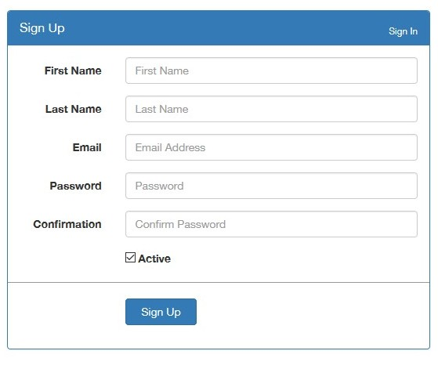

# codeigniter-simple-login-register
CodeIgniter simple login register with Bootstrap

**Requirement :**
 - CodeIgniter 3+
 - PHP 5.3+
 - MySQL

**Installation:**

 1. The folder _mpd contain the sql script for database, just copy
    paste and execute on your phpmyadmin This folder also contain the
    mpd built with MySQL Workbench
 2. maybe you need to change the base_url located on :
    application/config/config.php
 3. maybe you change the database configuration located on :
    application/config/database.php
 4. maybe you need to activate the rewrite_module in your httpd.conf for
    your apache webserver.

**Support:**

if you have questions contact me via : halim.webdev@gmail.com
